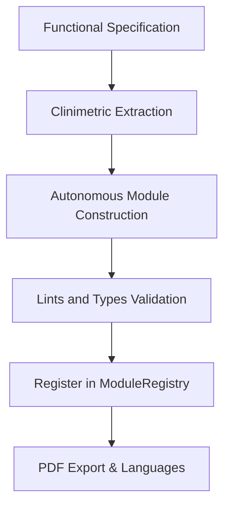

# Agentic AI in the Construction of Clinical Data Capture Systems: A Development Chronicle

## Executive Summary
This document reports the methodological and technical experience of developing the **Demo EDC** (codename *integrador*), a multi-device clinical capture application designed under the supervision of health researchers ("Human-in-the-Loop") and constructed using the Google Antigravity AI agent. It describes the design principles adopted in prompting, lessons learned from AI failures, and the technical guide for creating and injecting new evaluation modules.

---

## Purpose and Scope
This report acts as the primary methodological appendix for the manuscript *From Zero to Hero: Methodological Experience in the Iterative Construction of Clinical Data Capture Systems using Agentic AI*. It covers the documentation of the local capture software architecture, the critical analysis of the prompting process, and the design rules for future researchers extending the system.

---

## Methodological Architecture and Agent Rules

To ensure software maintainability against autonomous code generation by the AI, specific local development rules were structured for the workspace:



### 1. Autonomous and Independent Modules (Self-Contained)
Each clinical evaluation instrument (e.g., RAPA, PAR-Q, Consent) must be developed as a **self-contained unit**. The module must encapsulate its own business logic, graphic user interface (UI), translations, and clinimetric metadata. The application core (*integrador*) acts solely as a generic reader in charge of mounting and managing the registered module flows.

### 2. "Overkill" Design Principle
It was established as an agent prompt rule that the AI agent must always opt for the most robust and complete technological solution instead of a minimum viable product.
- *Practical Example:* When designing buttons, the agent was required to implement reactive micro-animations, fluid mobile adaptability (Responsive Design), and clear visual status indicators (enabled, disabled, loading).

### 3. Data Model Naming Schema
To avoid duplicate variables when multiple evaluations are active simultaneously, data fields are strictly named using the format:
`{module_name}_{field_name}` (e.g., `rapa_aerobic_score`, `parq_heart_condition`). This allows the integrator to apply data consistency rules when the same attribute (such as weight in kg) is required across different components.

### 4. Decentralized Localization & Translations
All interface text translations must reside within the module file itself, using the international standard **ISO 639-3** to identify languages (e.g., `spa` for Spanish, `eng` for English).

---

## Prompting Chronicle and Lessons Learned

### 1. What Worked (Success Heuristics)
- **Contract-Based Modularization (`ResearchModule`)**: Defining the abstract interface contract at the start allowed the AI agent to generate complex clinical modules autonomously with a 100% rate of successful individual compilation.
- **Atomic Prompts and Reduced Context**: Splitting requirements into distinct phases (e.g., core initialization, then UI design, then Riverpod state persistence) prevented agent hallucinations.
- **Immediate Input Capture Policies**: Integrating auto-save triggers on input (`onInput`) instead of waiting for a lost focus event (`onBlur`) guaranteed that no clinical records were lost during usability tests.

### 2. Debug Points and Resolved Technical Challenges
Throughout the development iterations, several system-level and environment errors arose, requiring direct troubleshooting instructions:

#### A. Windows PATH Environment Variable Corruption
- **Issue**: When trying to run Flutter commands or build the application, the agent and terminal failed with errors like `Unable to find git in your PATH` or `The command "WHERE" is not recognized`. This was caused by third-party installers overwriting the system variables and deleting default Windows paths.
- **Resolution Instruction**: The Windows paths were permanently restored by running the following block in PowerShell:
  ```powershell
  $currentUserPath = [Environment]::GetEnvironmentVariable("Path", "User");
  $newPath = "C:\Windows\System32;C:\Windows;C:\Windows\System32\Wbem;" + $currentUserPath;
  [Environment]::SetEnvironmentVariable("Path", $newPath, "User")
  ```
  This restored the visibility of critical tools (`git`, `where`, `cmd.exe`) for both the terminal and the AI agent.

#### B. Synchronization Lock Conflicts by Google Drive (`desktop.ini`)
- **Issue**: The project folder was synchronized in the cloud via Google Drive. This service auto-generates hidden system files named `desktop.ini` across multiple subdirectories. During Git indexing (`git status`, `git add`) and Flutter compilation, these files triggered "Access Denied" permissions errors and build aborts.
- **Resolution Instruction**: The system files were recursively removed using PowerShell commands, and [`.gitignore`](../.gitignore) was updated to ignore them permanently:
  ```powershell
  Get-ChildItem -Path "C:\path\to\project" -Filter "desktop.ini" -Recurse -Force | Remove-Item -Force
  ```
  Additionally, the following patterns were appended to [`.gitignore`](../.gitignore):
  ```text
  # Sync system files (Google Drive / Windows)
  desktop.ini
  **/desktop.ini
  ```

#### C. Accidental Close Mitigation: Minimize to System Tray in Windows
- **Issue**: Clinicians in the field tended to accidentally close the application by clicking the "X" on the window border, which interrupted field test timers and led to real-time telemetry data loss.
- **Resolution Instruction**: The `window_manager` and `tray_manager` packages were integrated. During core initialization, the window close event was intercepted to hide the window instead of destroying it, showing a persistent icon in the System Tray that restores the window via a double-click:
  ```dart
  // Intercept close event in the main window state
  @override
  void onWindowClose() async {
    bool isPreventClose = await windowManager.isPreventClose();
    if (isPreventClose) {
      await windowManager.hide(); // Hide to tray instead of exiting
    }
  }
  ```

### 3. What Failed (Lessons from AI Interaction)
- **Code Degradation via Saturated Context**: When the Antigravity chat window accumulated too much history or long files, the agent tended to rewrite files while deleting previously validated Riverpod state logic or PDF export routines. Mitigation consisted of starting clean chat sessions (compaction/summaries) with only the relevant contract interface and the specific files to edit.
- **Incomplete Tokenization due to Response Limits**: When developing complex UI widgets (with multiple animations and help modals), the agent frequently truncated responses mid-code. Control prompts were configured to force the agent to divide the UI into smaller sub-files or strictly resume from the last line.

---

## Structure and Integration Guide for New Modules

To integrate a new clinical module into the Demo EDC, the developer or the AI agent must implement the abstract interface `ResearchModule` provided in `lib/modules/module_registry.dart`.

### 1. The Interface Contract (`ResearchModule`)
Each module class must inherit and override the following mandatory properties and methods:

```dart
abstract class ResearchModule {
  String get id;
  String get name;
  String get description;
  IconData get icon;
  
  /// Defines the update/request frequency
  UpdateFrequency get updateFrequency;

  /// Decentralized translations in ISO 639-3 format
  Map<String, Map<String, String>> get translations;

  /// Clinimetric metadata matrix for the help "i" button
  Map<String, dynamic> get clinimetrics;

  /// PDF export and print routine
  Future<void> printToPdf(BuildContext context);
  
  /// Returns the visual evaluation view for the main flow
  Widget buildEvaluationView(BuildContext context, {required bool isLocked, Map<String, dynamic>? customConfig});
}
```

### 2. Configuring Request Frequency (`UpdateFrequency`)
Determines the persistence and behavior of the visual component for new records:
- **`unique` (Basically unique)**: Used for demographic data or identifiers. Applies a soft lock on the interface, requiring the user to press "Edit" to modify them.
- **`intermediate` (Periodic update)**: Used for health questionnaires (like PAR-Q). Alerts the clinician before overwriting historical records.
- **`dynamic` (Continuous dynamic)**: Used for physiological measurements or timers. Creates a new data record every time the evaluation is loaded.

### 3. Clinimetric Matrix and Information Button ("i")
To avoid cluttering the clinician's screen, the psychometric and clinimetric data of the instrument must be structured in the `clinimetrics` property under the following JSON format to feed the floating visual `"i"` component:

```json
{
  "name": "Full Test Name",
  "description": "What it evaluates and the target population",
  "reliability": {
    "test_retest": "ICC values obtained",
    "internal_consistency": "Internal consistency"
  },
  "reference_values": [
    {
      "population": "Pathology or Age group",
      "sem": "Standard error of measurement",
      "mcid": "Minimal clinically important difference",
      "cutoff": "Clinical cut-off score"
    }
  ],
  "references": [
    "Key bibliography 1",
    "Key bibliography 2"
  ]
}
```

### 4. State Management Integration (Riverpod)
When designing the graphic view (`buildEvaluationView`), the component's internal logic must notify the percentage of progress to the integrator. This is done by interacting with the global provider `evaluationSessionProvider`:

```dart
// Update progress (example for 80% completed)
ref.read(evaluationSessionProvider.notifier).updateCurrentModuleProgress(0.80);
```

---

## Instructions for AI Interpretation

When analyzing this documentation:
1. Adhere to the strict heading hierarchy.
2. Use the `ResearchModule` class contract as a mandatory template for the auto-generation of any new clinical test code in this workspace.
3. Do not alter the variable naming structure based on `{module_name}_{field_name}`.
4. Follow the local persistence state logic (`unique`, `intermediate`, `dynamic`) when designing database interactions.
