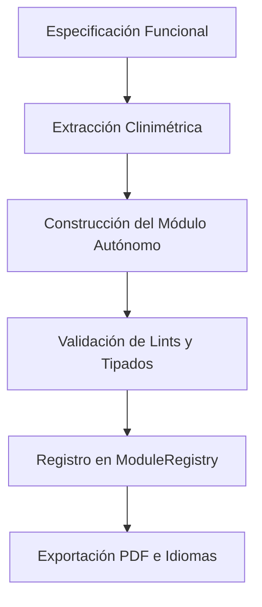

# IA Agéntica en la Construcción de Sistemas de Captura de Datos Clínicos: Crónica del Desarrollo

## Resumen Ejecutivo
Este documento reporta la experiencia metodológica y técnica del desarrollo del **Demo EDC** (codename *integrador*), una aplicación multidispositivo de captura clínica diseñada bajo la supervisión de investigadores de salud ("Human-in-the-Loop") y construida con el agente de IA Google Antigravity. Se describen los principios de diseño adoptados en el prompting, las lecciones aprendidas ante fallos de la IA y la guía técnica para la creación e inyección de nuevos módulos de evaluación.

---

## Propósito y Alcance
Este reporte actúa como el anexo metodológico principal del manuscrito *From Zero to Hero: Methodological Experience in the Iterative Construction of Clinical Data Capture Systems using Agentic AI*. Abarca la documentación de la arquitectura del software de captura local, el análisis crítico del prompting y las reglas de diseño para la extensión del sistema por parte de futuros investigadores.

---

## Arquitectura Metodológica y Reglas de Agente

Para garantizar la mantenibilidad del software frente a la generación autónoma de código por parte de la IA, se estructuraron reglas locales de desarrollo específicas para el espacio de trabajo:



### 1. Módulos Autónomos e Independientes (Self-Contained)
Cada instrumento de evaluación clínica (ej. RAPA, PAR-Q, Consentimiento) debe ser desarrollado como una **unidad autónoma**. El módulo debe encapsular su propia lógica de negocio, interfaz gráfica (UI), traducción y metadatos clinimétricos. El núcleo de la aplicación (*integrador*) actúa únicamente como un lector genérico encargado de montar y gestionar los flujos de los módulos registrados.

### 2. Principio de Diseño "Overkill"
Se estableció como regla de prompt que el agente de IA debe optar siempre por la solución tecnológica más robusta y completa en lugar del mínimo viable. 
- *Ejemplo práctico:* Al diseñar botones, se requirió al agente implementar micro-animaciones reactivas, adaptabilidad móvil fluida (Responsive Design) e indicadores visuales claros de estado (habilitado, deshabilitado, cargando).

### 3. Nomenclatura del Modelo de Datos (Naming Schema)
Para evitar la duplicidad de variables cuando se activan múltiples evaluaciones simultáneamente, los campos de datos se nombran estrictamente bajo el formato:
`{nombre_modulo}_{nombre_campo}` (ej. `rapa_aerobic_score`, `parq_heart_condition`). Esto permite al integrador aplicar reglas de consistencia de datos cuando un mismo atributo (como el peso en kg) se requiere en diferentes componentes.

### 4. Localización y Traducciones Descentralizadas
Toda traducción del texto de la interfaz debe residir dentro del propio archivo del módulo, utilizando la codificación estándar internacional **ISO 639-3** para identificar los idiomas (ej. `spa` para español, `eng` para inglés).

---

## Bitácora de Prompting y Lecciones Aprendidas

### 1. Lo que Funcionó (Heurísticas de Éxito)
- **Modularización Basada en Contratos (`ResearchModule`)**: Definir la interfaz abstracta al inicio permitió que el agente de IA generara módulos clínicos complejos de forma autónoma con una tasa de éxito del 100% en la compilación individual.
- **Prompts Atómicos y Contexto Reducido**: Dividir los requerimientos en fases (ej. inicialización del núcleo, luego diseño UI, luego persistencia Riverpod) evitó alucinaciones del agente de IA.
- **Políticas de Sincronización en la Captura**: Integrar el guardado automático mediante triggers de entrada inmediata (`onInput`) en lugar de esperar la pérdida de foco (`onBlur`) garantizó la no pérdida de registros en pruebas de usabilidad clínica.

### 2. Puntos de Debug y Desafíos Técnicos Superados
A lo largo de las iteraciones de prompting, surgieron fallos del sistema operativo y del entorno que requirieron intervención directa a través de instrucciones específicas:

#### A. Corrupción de Variables de Entorno del PATH de Windows
- **Problema**: Al intentar ejecutar comandos de Flutter o compilar la aplicación, el agente y la terminal fallaban arrojando errores como `Unable to find git in your PATH` o `El comando "WHERE" no se reconoce`. Esto se debió a que instaladores de software de terceros sobrescribieron las variables de sistema borrando rutas fundamentales de Windows.
- **Instrucción de Resolución**: Se inyectaron permanentemente las rutas de Windows ejecutando el siguiente bloque en PowerShell:
  ```powershell
  $currentUserPath = [Environment]::GetEnvironmentVariable("Path", "User");
  $newPath = "C:\Windows\System32;C:\Windows;C:\Windows\System32\Wbem;" + $currentUserPath;
  [Environment]::SetEnvironmentVariable("Path", $newPath, "User")
  ```
  Esto restauró la visibilidad de herramientas críticas (`git`, `where`, `cmd.exe`) tanto para la terminal del sistema como para el agente de IA.

#### B. Conflictos de Bloqueo por Google Drive (`desktop.ini`)
- **Problema**: La carpeta del proyecto se encontraba sincronizada en la nube mediante Google Drive. Este servicio genera automáticamente archivos ocultos del sistema llamados `desktop.ini` en múltiples subdirectorios. Durante los procesos de indexación de Git (`git status`, `git add`) y compilación de Flutter, dichos archivos generaban bloqueos de permisos ("Access Denied") y abortos de ejecución.
- **Instrucción de Resolución**: Se eliminaron los archivos de forma recursiva con comandos PowerShell y se actualizaron las reglas del archivo [`.gitignore`](../.gitignore) para omitirlos permanentemente:
  ```powershell
  Get-ChildItem -Path "C:\ruta\del\proyecto" -Filter "desktop.ini" -Recurse -Force | Remove-Item -Force
  ```
  Adicionalmente se agregaron los patrones al final de [`.gitignore`](../.gitignore):
  ```text
  # Archivos del sistema de sincronización (Google Drive / Windows)
  desktop.ini
  **/desktop.ini
  ```

#### C. Control de Cierre Accidental: Minimizar al System Tray en Windows
- **Problema**: Los médicos evaluadores en terreno tendían a cerrar la aplicación haciendo clic en la "X" del panel de la ventana por hábito operativo, lo que interrumpía el cronómetro de la prueba de marcha en campo y provocaba pérdida de datos de telemetría en tiempo real.
- **Instrucción de Resolución**: Se integraron los paquetes `window_manager` y `tray_manager`. Al inicializar el núcleo del software, se interceptó el evento del botón de cierre para ocultar la ventana en lugar de destruirla, mostrando un icono persistente en la bandeja de sistema (System Tray) para restaurarla mediante doble clic:
  ```dart
  // Interceptación de evento en el estado de la ventana principal
  @override
  void onWindowClose() async {
    bool isPreventClose = await windowManager.isPreventClose();
    if (isPreventClose) {
      await windowManager.hide(); // Oculta a la bandeja en lugar de salir
    }
  }
  ```

### 3. Lo que Falló (Lecciones de la Interacción con la IA)
- **Degradación del Código por Contexto Saturado**: Cuando la ventana de chat de Antigravity acumulaba demasiado historial de turnos o archivos adjuntos muy largos, el agente tendía a reescribir archivos eliminando lógica previa y validada de Riverpod o métodos de exportación PDF. La mitigación consistió en iniciar nuevas sesiones de chat (compaction / resumen) trayendo únicamente los contratos y los archivos a modificar.
- **Tokenización Incompleta por Límite de Respuesta**: En el desarrollo de widgets UI complejos (con múltiples animaciones y modales informativos), el agente a menudo cortaba las respuestas a mitad de la codificación. Se configuraron prompts de control forzando al agente a dividir la UI en submódulos de código o a continuar de forma estricta desde la última línea estructurada.

---

## Estructura y Guía de Integración de Nuevos Módulos

Para integrar un nuevo módulo clínico al Demo EDC, el desarrollador o el agente de IA debe implementar la interfaz abstracta `ResearchModule` provista en `lib/modules/module_registry.dart`.

### 1. El Contrato de Interfaz (`ResearchModule`)
Cada clase de módulo debe heredar y sobreescribir las siguientes propiedades y métodos obligatorios:

```dart
abstract class ResearchModule {
  String get id;
  String get name;
  String get description;
  IconData get icon;
  
  /// Define la tasa de actualización/solicitud
  UpdateFrequency get updateFrequency;

  /// Traducciones descentralizadas en formato ISO 639-3
  Map<String, Map<String, String>> get translations;

  /// Matriz de metadatos clinimétricos para el botón de ayuda "i"
  Map<String, dynamic> get clinimetrics;

  /// Rutina de exportación e impresión a PDF
  Future<void> printToPdf(BuildContext context);
  
  /// Retorna la vista visual de evaluación para el flujo principal
  Widget buildEvaluationView(BuildContext context, {required bool isLocked, Map<String, dynamic>? customConfig});
}
```

### 2. Configuración de la Tasa de Solicitud (`UpdateFrequency`)
Determina la persistencia y el comportamiento del componente visual ante nuevos registros:
- **`unique` (Básicamente único)**: Se usa para datos demográficos o identificadores. Aplica un bloqueo suave en la interfaz, requiriendo que el usuario presione "Editar" para alterarlos.
- **`intermediate` (Actualización periódica)**: Se usa para cuestionarios de salud (como PAR-Q). Alerta al clínico antes de sobrescribir el registro histórico.
- **`dynamic` (Dinámica continua)**: Se usa para mediciones fisiológicas o cronómetros. Crea un nuevo registro de datos cada vez que se carga la evaluación.

### 3. Matriz Clinimétrica y Botón Informativo ("i")
Para no sobrecargar la pantalla del clínico, los datos psicométricos y clinimétricos del instrumento deben estructurarse en la propiedad `clinimetrics` bajo el siguiente formato JSON para alimentar el componente visual flotante `"i"`:

```json
{
  "name": "Nombre completo del Test",
  "description": "Qué evalúa y población objetivo",
  "reliability": {
    "test_retest": "Valores de ICC obtenidos",
    "internal_consistency": "Consistencia interna"
  },
  "reference_values": [
    {
      "population": "Patología o Grupo etario",
      "sem": "Error estándar de medición",
      "mcid": "Mínimo cambio clínicamente importante",
      "cutoff": "Punto de corte clínico"
    }
  ],
  "references": [
    "Bibliografía clave 1",
    "Bibliografía clave 2"
  ]
}
```

### 4. Integración con el Estado de Sesión (Riverpod)
Al diseñar la vista gráfica (`buildEvaluationView`), la lógica interna del componente debe notificar el porcentaje de llenado al integrador. Esto se realiza interactuando con el proveedor global `evaluationSessionProvider`:

```dart
// Actualizar progreso (ejemplo para un 80% completado)
ref.read(evaluationSessionProvider.notifier).updateCurrentModuleProgress(0.80);
```

---

## Instrucciones para Interpretación por IA

Al analizar esta documentación:
1. Respetar la jerarquía estricta de encabezados.
2. Utilizar el contrato de la clase `ResearchModule` como plantilla obligatoria para la auto-generación de cualquier código de test clínico nuevo en este espacio de trabajo.
3. No alterar la estructura de nombres de variables basada en `{nombre_modulo}_{nombre_campo}`.
4. Seguir la lógica del estado de persistencia local (`unique`, `intermediate`, `dynamic`) al diseñar interacciones de bases de datos.
