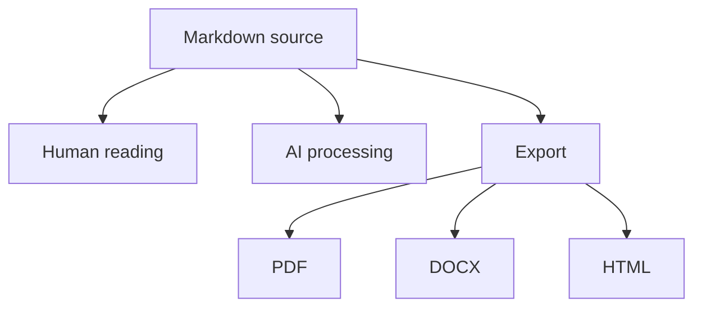

# Appendix: Non-Operational mdmake Skill Adaptation for Publication

## Publication Notice

This appendix is a **non-operational editorial adaptation** of a Markdown-production skill. It is not intended to be installed, executed, or distributed as a working Agent Skill. It reformulates the logic of the original skill as a transparent methodological artifact for scholarly publication.

All personal, institutional, project-specific, local-path, software-environment, and workflow-identifying information has been removed or replaced with the instruction **customize according to needs**.

## Purpose

The purpose of this adapted skill is to guide the creation, correction, restructuring, and conversion of high-quality Markdown documents for human reading, academic use, technical documentation, multi-format export, and AI interpretation.

The adaptation follows the public Agent Skills specification and skill-creation best-practice recommendations by emphasizing:

- concise metadata;
- a clear activation description;
- reusable procedural guidance;
- moderate detail;
- progressive disclosure;
- validation checklists;
- explicit quality criteria;
- privacy-preserving placeholders.

## Publication-Safe Skill Metadata

The original operational skill can be represented for publication with the following anonymized metadata:

```yaml
---
name: mdmake
description: Create, correct, structure, or convert high-quality Markdown documents for human reading, academic writing, technical documentation, multi-format export, and AI interpretation. Use when the task involves Markdown files, README files, reports, guides, protocols, manuals, knowledge bases, Mermaid diagrams, YAML frontmatter, reusable documentation, or export-ready structured text.
---
```

> [!NOTE]
> This block is included for documentation and reproducibility only. It is not provided as an installable `SKILL.md` file.

## Conceptual Role

`mdmake` treats Markdown as a source of structured knowledge rather than as a lightweight formatting convenience. A well-formed Markdown document should remain readable by humans, processable by software, interpretable by AI systems, and exportable to formats such as PDF, DOCX, HTML, slides, learning-management-system content, or knowledge-base entries.

```text
document.md
|-- human reading
|-- AI interpretation
|-- PDF export
|-- DOCX export
|-- HTML export
|-- slide generation
|-- knowledge-base reuse
`-- long-term maintenance
```

## Intended Use

Use this adapted workflow when the output requires:

- a new or revised Markdown document;
- academic or technical documentation;
- a README, guide, protocol, manual, report, or appendix;
- reusable Markdown for AI, RAG, NotebookLM-like systems, or knowledge bases;
- export-ready Markdown for PDF, DOCX, HTML, slides, or LMS materials;
- YAML frontmatter;
- structured tables;
- Mermaid diagrams;
- glossary or appendix sections;
- improved readability, portability, traceability, and maintenance.

## Core Principle

Markdown should serve as the **single source of truth** for the document.

Content, structure, metadata, and export logic should remain sufficiently explicit that the file can be transformed into other formats without losing its hierarchy, meaning, or provenance.

## Structural Rules

Apply the following rules to formal Markdown documents:

1. Use one top-level `#` title per document.
2. Use `##` for main sections.
3. Use `###` for subsections.
4. Do not skip heading levels.
5. Do not use headings for visual emphasis only.
6. Keep headings brief, informative, and consistent.
7. Make each paragraph communicate one main idea.
8. Use numbered lists for sequences.
9. Use bullet lists for non-sequential sets.
10. Use tables only for comparison, synthesis, or structured data.
11. Avoid using tables to contain long prose.
12. Preserve UTF-8 encoding.

## Recommended Frontmatter

Formal documents should begin with YAML frontmatter when metadata improves traceability.

```yaml
---
title: "Customize according to needs"
summary: "Customize according to needs"
document_type: "Customize according to needs"
domain: "Customize according to needs"
audience: ["Customize according to needs"]
intended_use: "Customize according to needs"
version: "1.0"
date: "YYYY-MM-DD"
language: "en"
status: "draft"
---
```

Do not include names, institutional affiliations, local file paths, email addresses, project names, private datasets, or software-specific identifiers unless the publication context explicitly permits them.

## Recommended Sections for Long Documents

Use this structure when the user requests a substantial academic, technical, or methodological document:

```markdown
# Document Title

## Executive Summary

## Purpose

## Intended Audience

## Scope

## Context

## Operational Definitions

## Assumptions

## Key Messages

## Development

## Procedure or Methodology

## Quality Criteria

## Risks, Warnings, or Limitations

## Instructions for AI Interpretation

## Conclusions

## Glossary

## References

## Appendices
```

## Instructions for AI Interpretation

For documents intended to be reused by AI systems, include a dedicated section such as:

```markdown
## Instructions for AI Interpretation

When analyzing this document:

1. Preserve the heading hierarchy as the primary structure.
2. Prioritize operational definitions included in the document.
3. Do not infer external information unless explicitly instructed.
4. Preserve dates, weights, criteria, and named placeholders.
5. Distinguish facts, interpretations, instructions, and recommendations.
6. If converting to another format, preserve tables, numbered lists, and warnings.
```

## Semantic Blocks

Use callouts only when they add interpretive value:

```markdown
> [!NOTE]
> Supplementary information.

> [!IMPORTANT]
> Mandatory instruction.

> [!WARNING]
> Relevant warning.

> [!SUMMARY]
> Section synthesis.

> [!EVIDENCE]
> Evidence or scientific rationale.
```

## Mermaid Diagrams

Use Mermaid diagrams when they clarify workflows, taxonomies, decision paths, conceptual relationships, or document architecture.

Rules:

- Use Mermaid only when it improves comprehension.
- Keep node labels short.
- Avoid oversized diagrams.
- Provide a textual equivalent when the publication destination may not render Mermaid.
- Prefer simple, stable syntax for AI or script-based reuse.

Example:



## File-Naming Convention

Use stable, descriptive, versioned file names.

Recommended pattern:

```text
YYYY-MM-DD_document-type_topic_v1.md
```

Examples:

```text
2026-06-08_methodological_appendix_markdown_workflow_v1.md
2026-06-08_publication_ready_protocol_template_v1.md
2026-06-08_ai_interpretation_guidelines_v1.md
```

Avoid names such as:

```text
final_document.md
good_version.md
final_final_revised.md
copy_latest.md
```

## Separation of Content, Design, and Data

When a document includes complex assets or export targets, separate the source content from presentation and data files.

```text
content.md
styles.css
data.csv
references.bib
images/
exports/
```

Do not overload Markdown with unnecessary HTML. Use limited HTML only when Markdown cannot express the required structure and the target platform supports it.

## Links and Images

For publication-oriented Markdown:

- prefer relative links inside the project or manuscript package;
- avoid absolute local paths;
- include descriptive alternative text for images;
- number figures when used in academic contexts;
- never rely on an image alone to communicate critical information;
- replace any identifying visual, file path, or local system reference with **customize according to needs**.

## mdmake Workflow

The adapted workflow is:

1. Identify the document purpose, audience, scope, and destination.
2. Select the appropriate template: long-form, technical, academic, README, report, guide, protocol, or appendix.
3. Define relevant YAML frontmatter.
4. Build a heading hierarchy without skipped levels.
5. Write short, self-contained paragraphs.
6. Use lists, tables, and Mermaid diagrams with semantic intent.
7. Separate facts, interpretations, instructions, and recommendations.
8. Add AI-interpretation instructions when the document will be used by AI systems.
9. Validate encoding, links, tables, diagrams, references, and consistency.
10. Remove or replace all personal, institutional, local-path, and project-identifying details.

## Quality Criteria

| Criterion | Guiding question |
|---|---|
| Clarity | Can the document be understood without additional explanation? |
| Hierarchy | Do headings represent a logical structure? |
| Consistency | Are similar elements formatted consistently? |
| Traceability | Are title, date, version, status, and purpose clear when needed? |
| Portability | Can the file be opened outside the original software environment? |
| Processability | Can scripts or AI systems parse the structure without losing meaning? |
| Accessibility | Are images described and text blocks readable? |
| Reusability | Can sections be adapted to other formats? |
| Maintainability | Is the document easy to revise and version? |
| Exportability | Can the document become PDF, HTML, DOCX, or slides without losing key information? |
| Anonymization | Have all identifying elements been removed or replaced? |

## Prohibited Errors

Avoid the following:

- using Markdown only as visual decoration;
- creating false heading hierarchies;
- using ambiguous references such as "this" or "the above" without context;
- mixing content, design, data, and instructions without structure;
- degrading UTF-8 characters as a preventive strategy;
- using tables to hide long prose;
- creating formal documents without purpose, audience, or scope;
- including personal names, local paths, institutional affiliations, private datasets, project names, credentials, or private logs;
- presenting this appendix as an operational skill package.

## Publication Anonymization Rule

Any connection to a person, institution, project, local infrastructure, dataset, app, clinical workflow, software environment, or unpublished implementation must be replaced with one of the following:

- **customize according to needs**;
- **customize according to local environment**;
- **customize according to institutional requirements**;
- **customize according to data governance requirements**;
- **customize according to publication policy**.

## Alignment With Agent Skills Recommendations

This publication-oriented adaptation reflects the Agent Skills specification by documenting the `name` and `description` fields, explaining the expected role of a Markdown body, and preserving the idea of optional resources without packaging them as operational directories.

It also reflects the best-practice guidance by:

- grounding the skill in a concrete document-production workflow;
- adding only information the agent is likely to need;
- favoring procedures over declarations;
- providing defaults rather than long menus;
- including gotchas and validation criteria;
- keeping the main guidance concise enough for reuse;
- using progressive disclosure as a design principle;
- documenting publication-safe anonymization.

## Limitations

This appendix is a methodological and editorial artifact. It should not be interpreted as a complete technical implementation, a validated software package, or an executable workflow. Before reuse, the content should be reviewed by the relevant authors, journal editors, institutional reviewers, and data governance stakeholders.

## References

1. Agent Skills. "Specification." Accessed 2026-06-08. <https://agentskills.io/specification>
2. Agent Skills. "Best practices for skill creators." Accessed 2026-06-08. <https://agentskills.io/skill-creation/best-practices>

